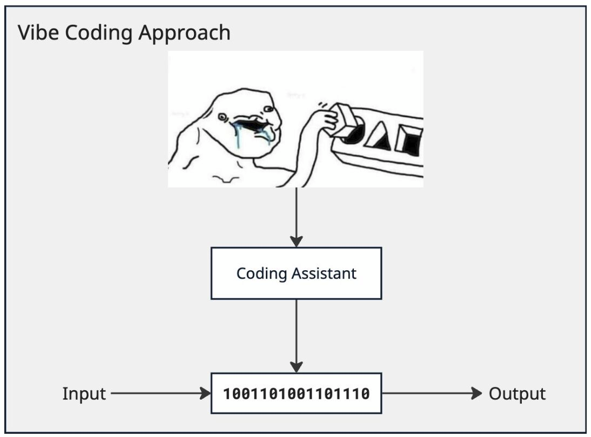
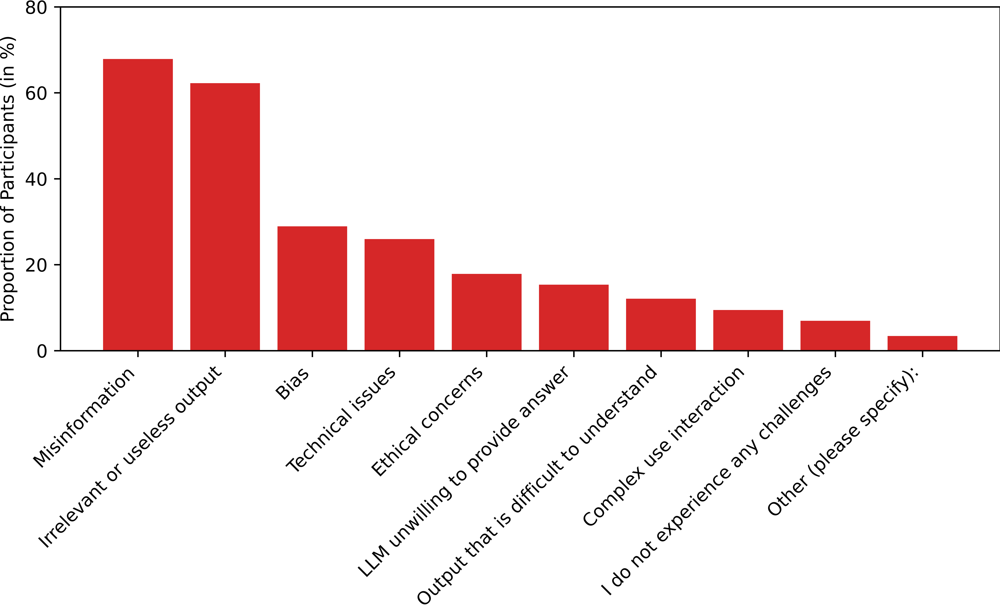

# My Point Of View On LLMs
:::: {.columns}

::: {.column width="60%"}

- My personal opinion on LLMs
- The downsides of using LLMs
- My personal usage of LLMs
:::

::: {.column width="40%"}

{#fig-llm-usage}

:::

::::

# My Personal Opinion On LLMs
:::: {.columns}

::: {.column width="60%"}
- Not worth the hype and the money
- Trained without respecting licenses and data protection laws
- Likely a bigger threat than we realize
- Isn't that great at coding
- Very hard to secure

:::

::: {.column width="40%"}

{#fig-xkcd}

:::

::::

# The Downsides Of Using LLMs

- Very hard to secure (see my blog post [here](https://olivier.amacker.dev/305.2-applied-cybersecurity/){target="_blank"})
- Allows people to ship crappy code (see [this PR](https://github.com/facebook/docusaurus/pull/12105#pullrequestreview-4534633134){target="_blank"})
- Spams open source developers with AI slop PR (see Matplotlib maintainer blog article [here](https://theshamblog.com/an-ai-agent-published-a-hit-piece-on-me/){target="_blank"})
- Divide the community regarding AI policy (see Zig no AI [policy](https://codeberg.org/ziglang/zig#user-content-strict-no-llm-no-ai-policy){target="_blank"})
- Leads to cognitive debt (see @kosmyna2025brainchatgptaccumulationcognitive [here](https://arxiv.org/abs/2506.08872){target="_blank"})

# The Downsides Of Using LLMs

:::: {.columns}

::: {.column width="60%"}

- Isn't actually cheaper than regular junior devs (see blog article [here](https://www.labvent.co/blog/post/llm-vs-junior-dev-cost-2025/){target="_blank"})
- Reduces creativity (see @MOON2025100207 [here](https://www.sciencedirect.com/science/article/pii/S294988212500091X){target="_blank"})
- Doesn't actually increase developer productivity (see @becker2025measuringimpactearly2025ai [here](http://arxiv.org/abs/2507.09089){target="_blank"})
- Gives unreliable information (see @alansari2026largelanguagemodelshallucination [here](https://arxiv.org/abs/2510.06265){target="_blank"})

:::

::: {.column width="40%"}

{#fig-ai-chall}

:::

:::

# My Personal Usage Of LLMs

- I use exclusively open weight models
- I take an extra step and self-host fully open source models (public weights and training data) like [SmolLM3](https://huggingface.co/HuggingFaceTB/SmolLM3-3B){target="_blank"} with moderate quantization when the data I'm working with is proprietary
- I mostly use LLMs to explain things with extra fact checking
- I only use LLMs to write code I can easily double-check (so only code I've already written a couple of times)
- I also sometimes use [OpenCode](https://opencode.ai/){target="_blank"} a [FOSS](https://fr.wikipedia.org/wiki/Free/Libre_Open_Source_Software){target="_blank"} Claude-Code alternative, which hosts free open weight models like [GLM-4.7](https://huggingface.co/zai-org/GLM-4.7){target="_blank"}

# Additional Resources
Here is the slide deck link, if you need extra information
[https://olivier.amacker.dev/bachelor-thesis/site/presentations/ai_usage.html](https://olivier.amacker.dev/bachelor-thesis/site/presentations/ai_usage.html){target="_blank"}

{#fig-qr}

# Additional LLMs Things

{#fig-qr}

[LLMs amplify human bias](https://arxiv.org/pdf/2505.02151){target="_blank"}

[LLMs political bias](https://arxiv.org/pdf/2601.08785){target="_blank"}

[LLMs citation hallucinations](https://arxiv.org/pdf/2605.07723){target="_blank"}

# References

::: {#refs}
:::
