# What Is The Problem With The Current fMRI Pipelines?

:::: {.columns}

::: {.column width="60%"}

Currently the fMRI pipelines are becoming more and more computationally heavy leveraging a lot of high dimension calculations.

However, there are several settings introducing noise instability in those pipelines:
  
- The OS running the pipeline and its version
- The actual hardware (CPU architecture)
- Parallelization strategies

:::

::: {.column width="40%"}

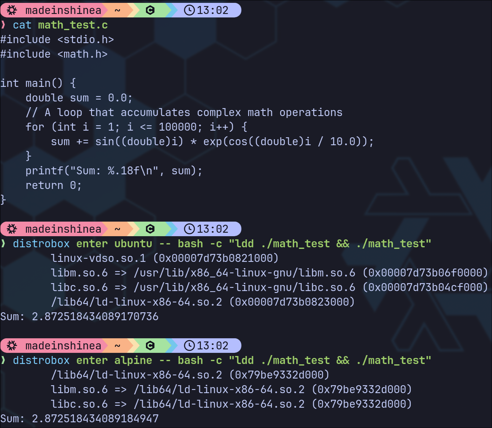{#fig-os-results}

:::

::::

# What Can We Do About It?

We can artificially introduce numerical perturbations inside the floating point arithmetic with the help of tools like [Verificarlo](https://github.com/verificarlo/verificarlo){target="_blank"}(@denis2018verificarlocheckingfloatingpoint) and [Fuzzy](https://github.com/verificarlo/fuzzy){target="_blank"} and assess how the desired pipeline's results change to make sure it is stable. 

Verificarlo is a compiler wrapper that instruments floating point operations at the LLVM level.

Fuzzy is a Docker ecosystem that provides pre instrumented versions of common numerical libraries so you can evaluate a pipeline's stability without recompiling your own code.

# Was This Done Before?

Yes, there are already several papers on the subject, like @Alizadeh2025.12.22.695524 or @Chatelain2026.01.09.698203.

But numerical instability is not transferable across pipelines, it comes from each pipeline's specific algorithms, operation orders, software stacks etc.

Benchmarking each one is essential.

# What Did I Do Regarding that?

My job was to look into the numerical stability of fMRI biomarkers.

To do so, I focused on three main tasks:

- Reproduce the @Alizadeh2025.12.22.695524 paper on NPVR of MRI graph metrics
- Perturb fMRIPrep (@fMRIPrep) runs via Verificarlo and assess changes in FC matrices
- Assess whether the @10.1162/IMAG.a.1121 PCA feature selection remains stable under numerical perturbations

A detailed summary of what I did each day is available [here](https://olivier.amacker.dev/bachelor-thesis/site/daily_journal.html)

{#fig-daily-journal-qr height="100px"}
 

# @Alizadeh2025.12.22.695524 Paper Goals

The paper has two goals:

 - Demonstrate on artificial data that NPVR increase uncertainty in Cohen's $d$ estimates, with stronger effects at small $n$.
 - Assess how numerical perturbations via Verificarlo of fMRIPrep runs impact the NPVR of various graph metrics.

Here is the formula for the NPVR:

$$NPVR = \frac{\sigma_{num}}{\sigma_{pop}}$$

Where $\sigma_{num}$ is the numerical variability and $\sigma_{pop}$ is the population variability.

# @Alizadeh2025.12.22.695524 Reproduction Resources

A summary of this paper is available [here](https://github.com/MadeInShineA/bachelor-thesis-project/blob/7f64cf4d877eae5833f990eae917c7211c644841/resources/alizadeh-2025-paper-summary/Alizadeh2025_paper_summary.md){target="_blank"}

{#fig-paper-summary-qr height="100px"}

The code used for this section is available [here](https://olivier.amacker.dev/bachelor-thesis/site/notebooks/npvr-simulation/){target="_blank"}

{#fig-npvr-qr height="100px"}

# Artificial NPVR Results Comparison

::: {layout="[ [1, 1, 1], [1, 1, 1] ]"}

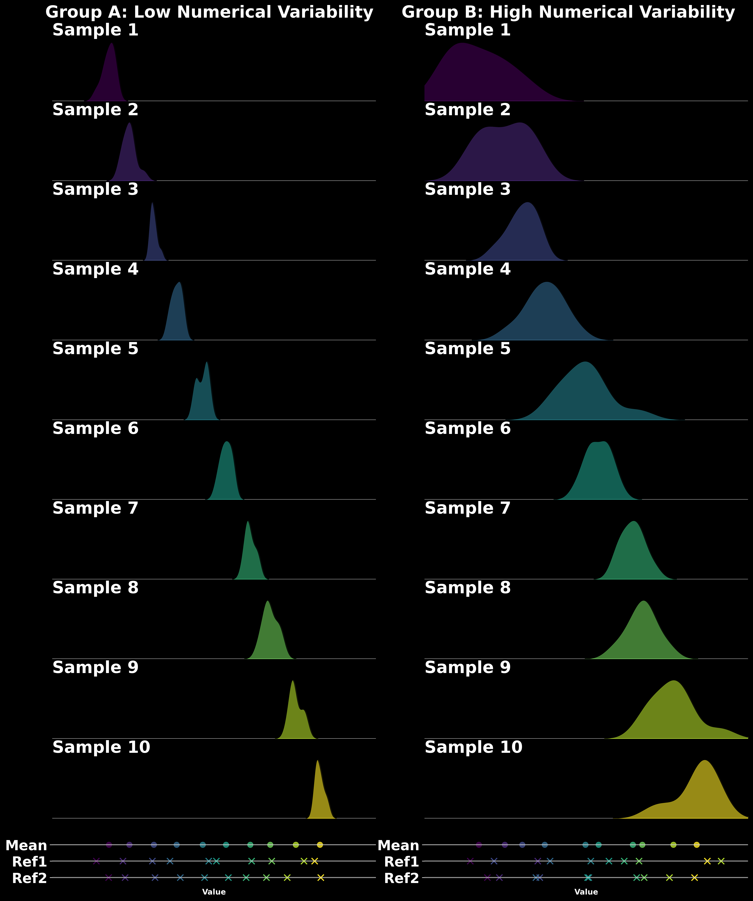{#fig-npvr-populations width="100%" height="150px"}

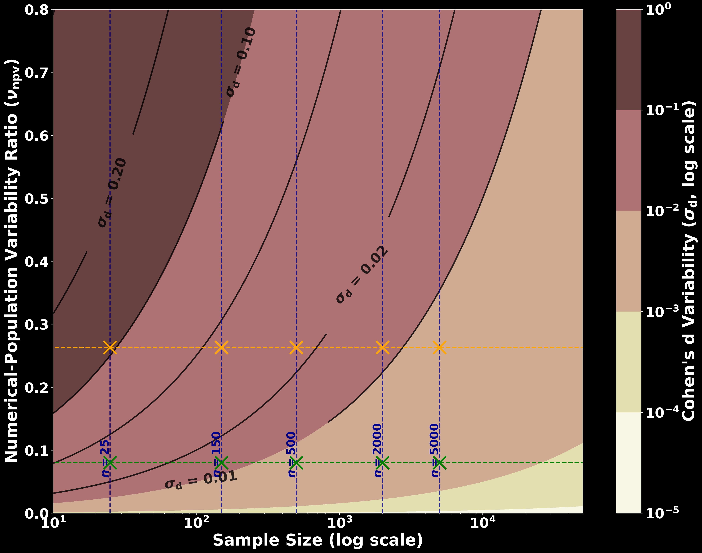{#fig-npvr-sample-size width="100%" height="150px"}

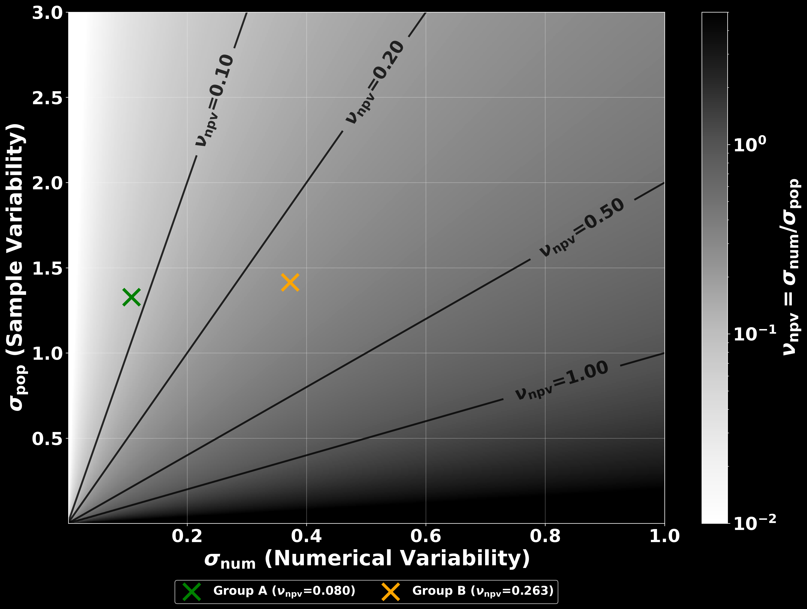{#fig-dnum-variation width="100%" height="150px"}

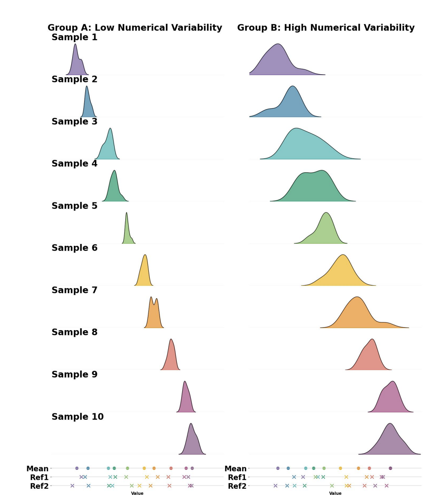{#fig-original-population width="100%" height="150px"}

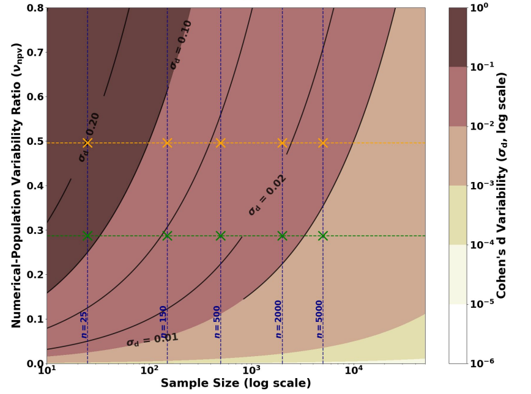{#fig-original-cohens width="100%" height="150px"}

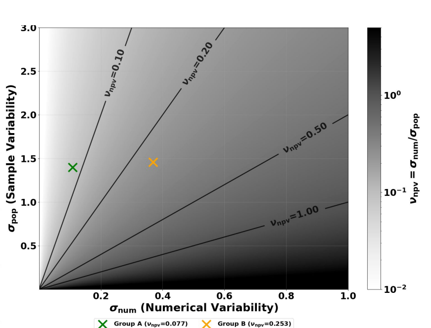{#fig-original-npvr width="100%" height="150px"}

:::

# Artificial NPVR PR

Regarding the Relation between the NPVR and the Cohen's $d$ differences, a PR was opened and merged into the paper's repository (see [here](https://github.com/mina94az/Numerical-Variability-of-functional-MRI-Graph-Measures/pull/3){target="_blank"})

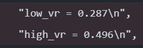{#fig-npvr-pr height="100px"}

# @Alizadeh2025.12.22.695524 Graph Metrics

Here are the different graph metrics that were computed once with and once without confounds regression

Four local graph metrics were computed:

  - Degree centrality
  - Clustering coefficient
  - Betweenness centrality
  - Eigenvector centrality

Two global metrics:

  - Small-worldness
  - Average shortest path length

  
# Graph Metrics Reproduction Code

The code used for this section is available [here](https://olivier.amacker.dev/bachelor-thesis/site/notebooks/fuzzy-fmriprep-graph-metrics-analysis.html){target="_blank"}

{#fig-graph-metrics-qr height="100px"}

# Graph Metrics Results Comparison

::: {layout="[1, 1]"}

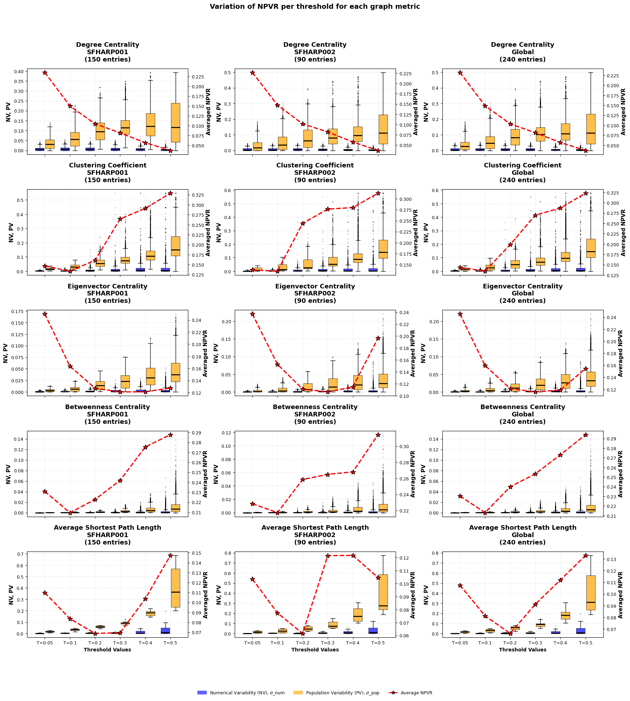{#fig-graph-metrics-threshold width="100%" height="500px"}

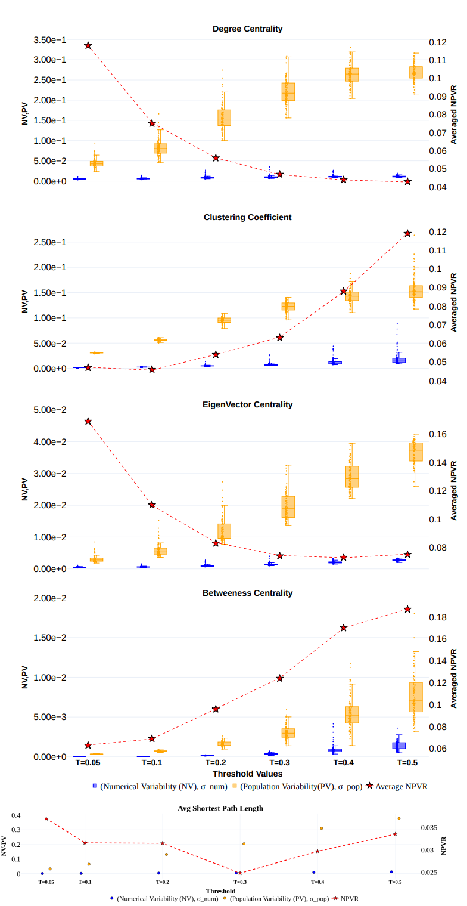{#fig-original-graph-metrics-threshold width="100%" height="500px"}

:::

# Graph Metrics Results Comparison

::: {layout="[1, 1]"}

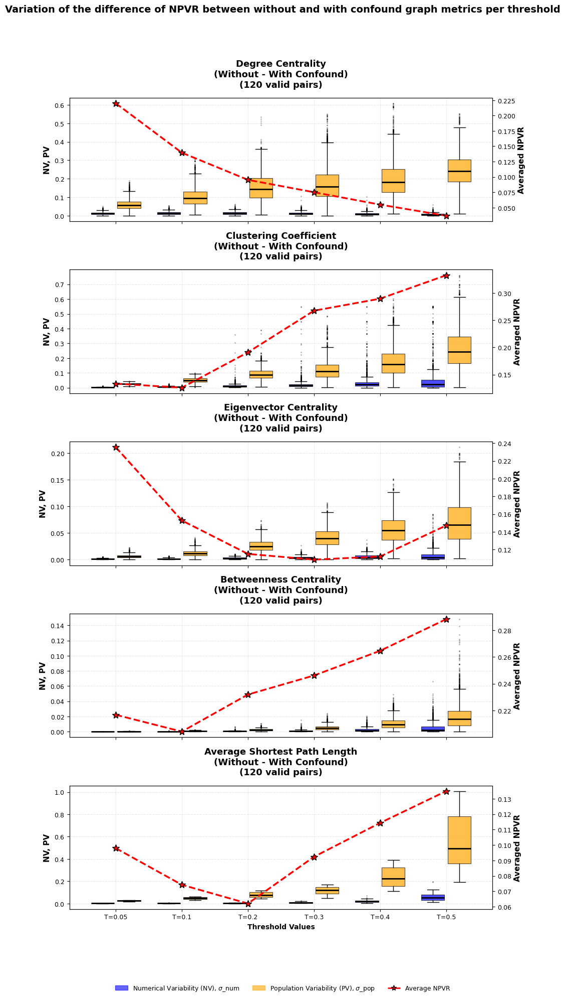{#fig-npvr-variation width="100%" height="500px"}

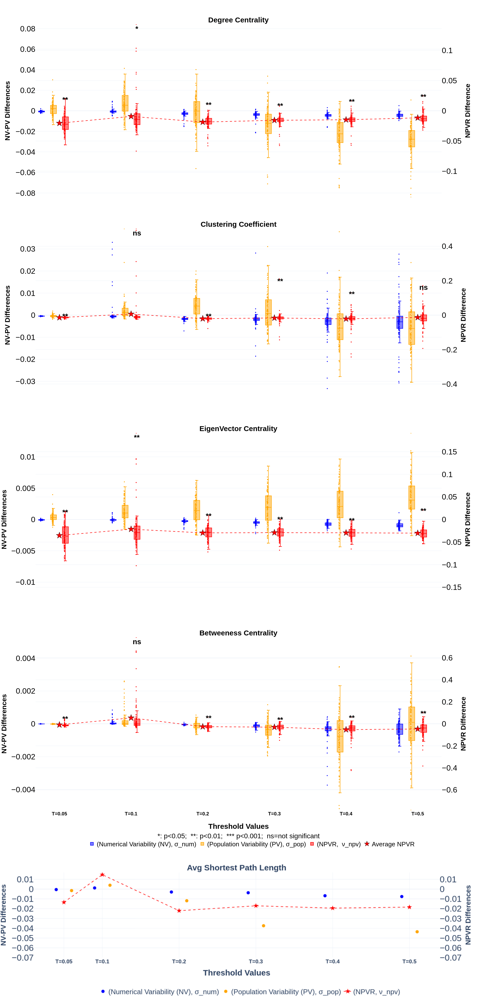{#fig-npvr-variation-paper width="100%" height="500px"}
:::

# Graph Metrics Results Comparison

::: {layout="[1, 1]"}

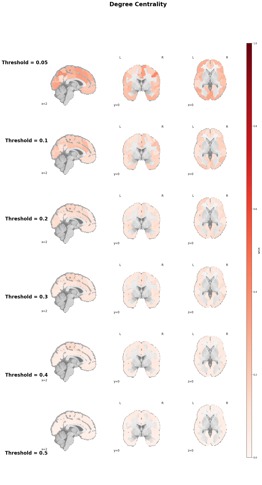{#fig-brain-regions-npvr width="100%" height="500px"}

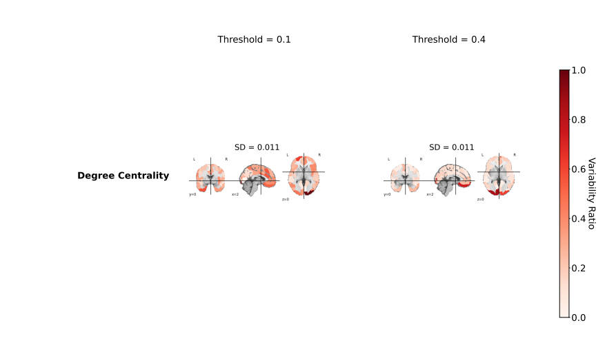{#fig-brain-region-npvr-paper width="100%" height="500px"}
:::

# Perturbed fMRIPrep Runs FC Matrices Analysis Goals

The goal of this section was to take the numerically perturbed fMRIPrep runs that were made so far, and assess how the NPVR changes across the different FC matrix edges.

So this looks into the FC matrices directly rather than graph metrics like the previous section.

# Perturbed fMRIPrep Runs FC Matrices Analysis Code

The code used for this section is available [here](https://olivier.amacker.dev/bachelor-thesis/site/notebooks/fuzzy-fmriprep-fc-matrices-analysis.html){target="_blank"}

{#fig-fuzzy-fc-matrices-qr height="100px"}

# Perturbed fMRIPrep Runs FC Matrices Analysis Results

::: {layout="[1, 1]"}

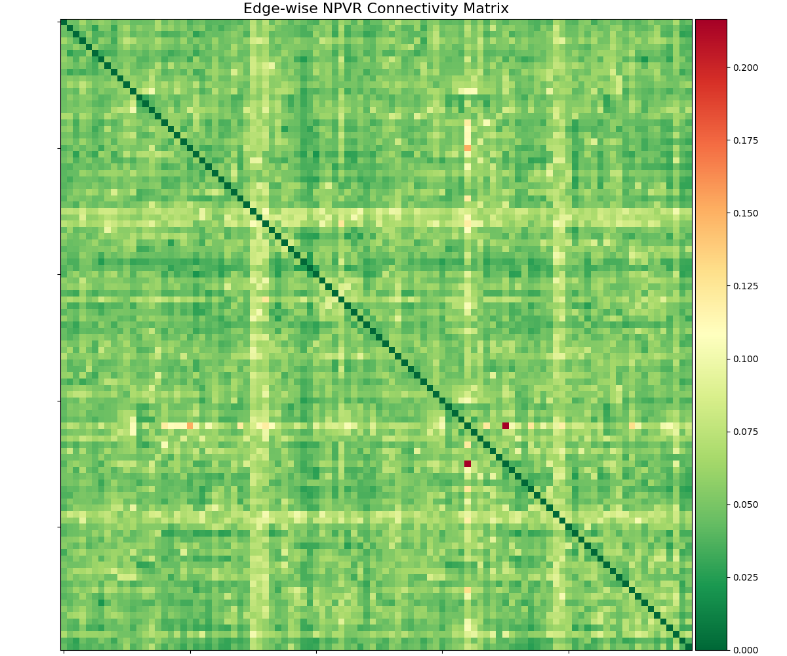{#fig-fc-edge-npvr width="100%" height="500px"}

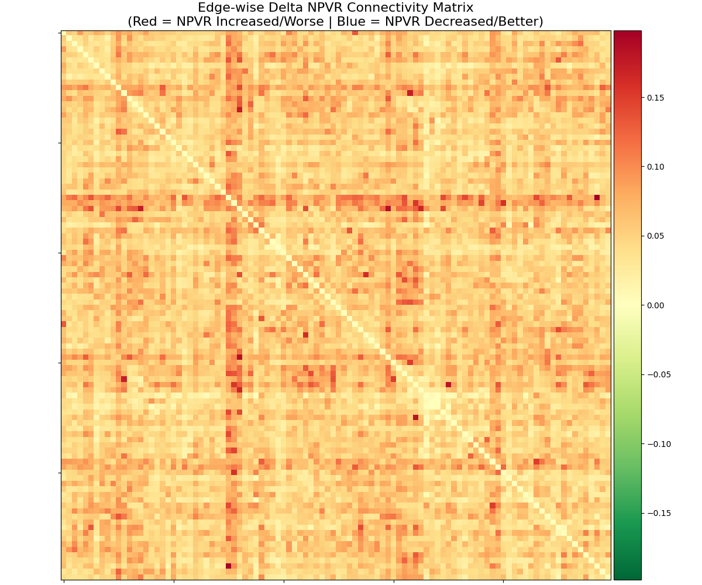{#fig-fc-edge-npvr-paper width="100%" height="500px"}
:::

# @10.1162/IMAG.a.1121 PCA Feature Selection Stability Analysis

The goal of this paper is to develop a PCA-based feature selection method that robustly extracts reliable FC biomarkers
for major depressive disorder (MDD), schizophrenia (SCZ), and autism spectrum disorder (ASD) across 
multiple independent datasets and imaging sites, overcoming the instability issues of conventional supervised feature selection approaches.

# Original PCA Feature Selection Explanation

The PCA feature selection works as follows:

- A PCA is computed on all subjects' FC vectors (n × m) to reduce dimensionality to n principal components.
- PCs are tested for association with variables of interest:
  - Binary categorical (e.g., diagnosis, sex): two-sample t-test
  - Multi-level categorical (e.g., imaging site): one-way ANOVA
  - Continuous (e.g., age, BDI, head motion): Pearson's correlation
- Select PCs significantly associated with the target after FDR-BH correction (q < 0.05)
- Test FC weights using a chi-squared test with FDR-BH correction (q < 0.05)
- Keep only FCs that survive the correction as the final biomarkers

# What Did I Change In The PCA Feature Selection Code?

I made several changes to the PCA feature selection code:
 - Transformed the repository from regular Python code to a Python package (see PR [here](https://github.com/Ayumu722/pca-based-feature-extraction/pull/1){target="_blank"})
 - Improved the PC plots (see PR [here](https://github.com/Ayumu722/pca-based-feature-extraction/pull/3){target="_blank"})
 - Added a more stable option for the PC selection (see PR [here](https://github.com/Ayumu722/pca-based-feature-extraction/pull/5){target="_blank"})

# PCA Feature Selection Stability Analysis Code

The code used for this section is available [here](https://olivier.amacker.dev/bachelor-thesis/site/notebooks/fuzzy-pca-dim-reduction-analysis.html){target="_blank"}

{#fig-fuzzy-pca-qr height="100px"}

# PCA Feature Selection Stability Analysis Procedure

To conduct this analysis, I performed the following steps:

- Reproduced the PCA feature selection on the complete SRPB dataset (which was split into training and test sets)
- Reproduced the PCA feature selection on the BMB dataset (a new dataset)
- Ran 100 perturbation runs of the SRPB dataset FC matrix extraction (perturbing the `np.corrcoef` function)
- Ran 15 perturbation runs of the BMB dataset FC matrix extraction

The PCA feature selection was performed on each of the perturbation runs

# PCA Feature Selection Stability Results

:::{layout="[[1,1], [1, 1]]"}
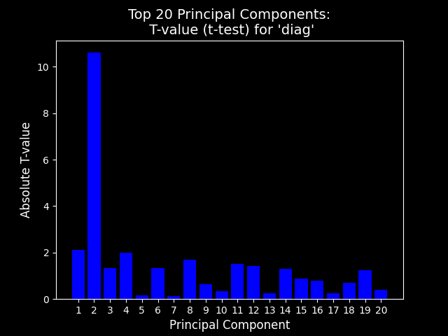{#fig-srpb-fuzzy-diag-pc-graph height="200px"}

{#fig-srpb-original-diag-pc-graph height="200px"}

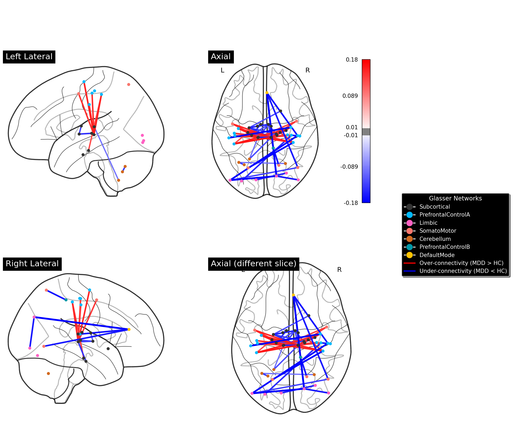{#fig-srpb-fuzzy-consensus-fc-graph height="200px"}

{#fig-srpb-original-fc-graph height="200px"}

:::

# PCA Feature Selection Stability Results

:::{layout="[[1,1], [1, 1]]"}
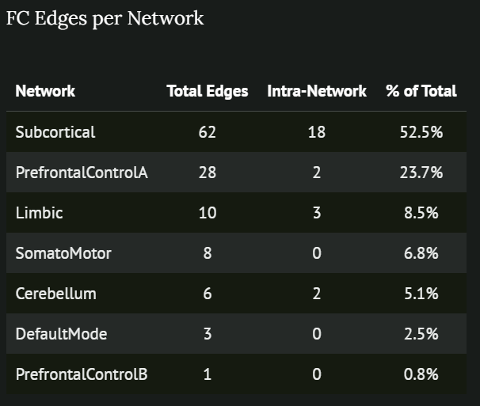{#fig-srpb-fuzzy-fc-edge height="200px"}

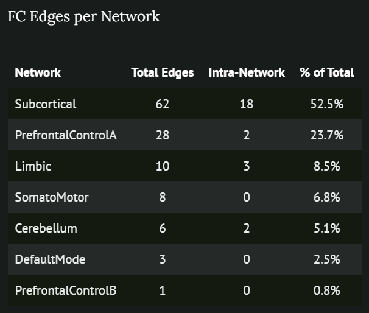{#fig-srpb-original-fc-edge height="200px"}

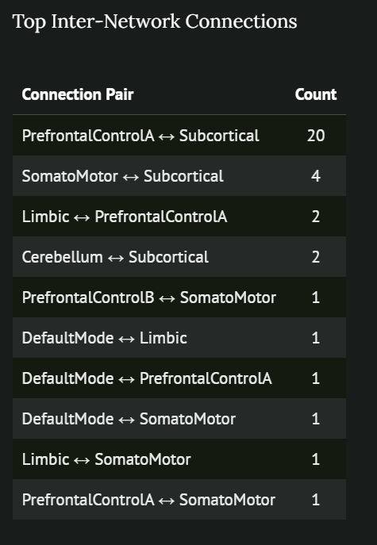{#fig-srpb-fuzzy-consensus-fc-inter height="200px"}

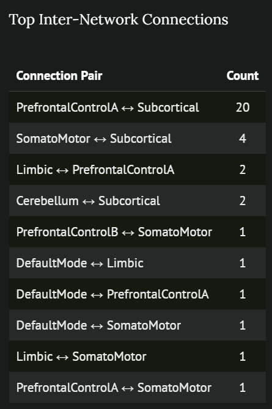{#fig-srpb-original-fc-inter height="200px"}

:::

# PCA Feature Selection Stability Results

:::{layout="[[1,1], [1, 1]]"}
{#fig-bmb-fuzzy-diag-pc-graph height="200px"}

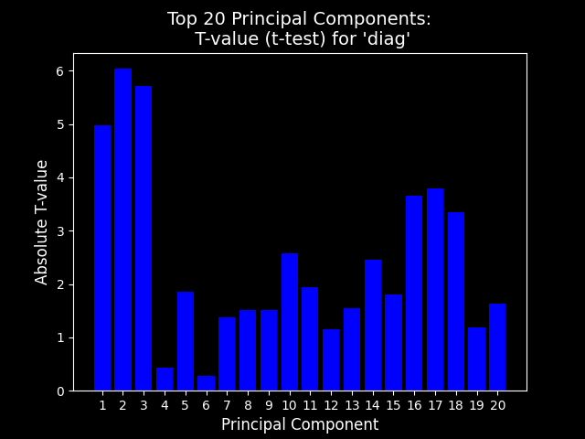{#fig-bmb-original-diag-pc-graph height="200px"}

{#fig-bmb-fuzzy-consensus-fc-graph height="200px"}

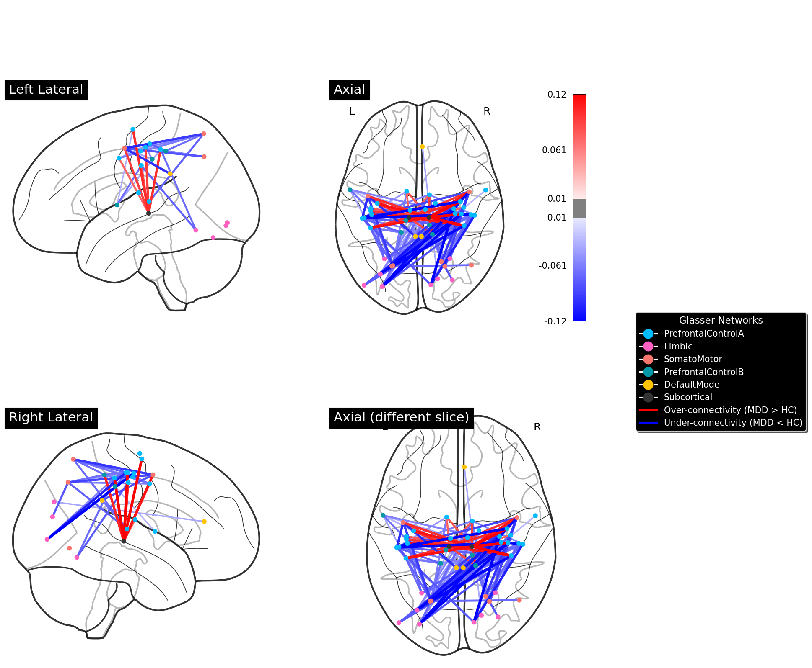{#fig-bmb-fuzzy-original-fc-graph height="200px"}

:::

# PCA Feature Selection Stability Results

:::{layout="[[1,1], [1, 1]]"}
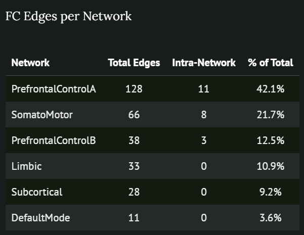{#fig-bmb-fuzzy-consensus-edge-graph height="200px"}

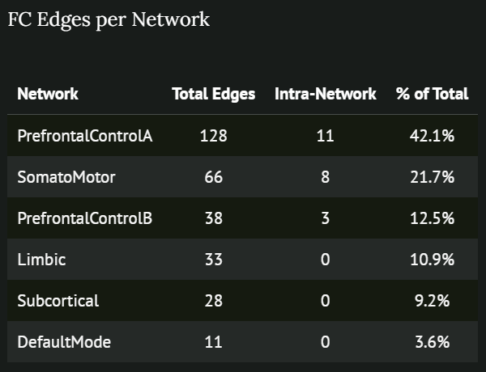{#fig-bmb-original-edge-graph height="200px"}

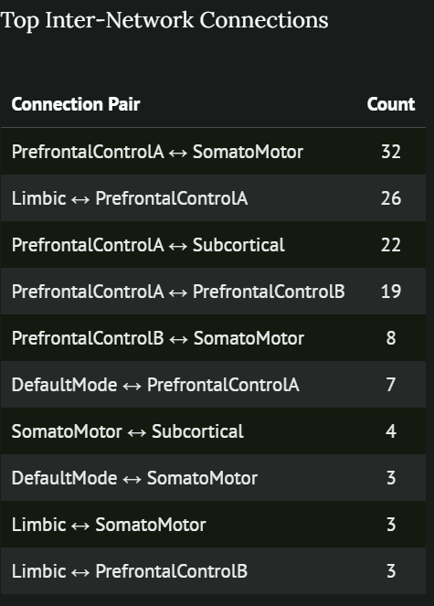{#fig-bmb-fuzzy-consensus-inter height="200px"}

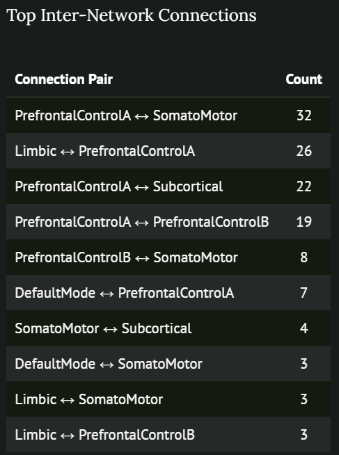{#fig-bmb-original-inter height="200px"}

:::

# Conclusion

The PC selection step of the PCA feature extraction has been improved, and the complete pipeline seems to be very stable now!

It would be interesting to perturb more steps of the FC matrices extraction other than the `np.corrcoef`.

The subject was very interesting and I'm very grateful to all of you and Prof. Esteban for giving me this opportunity.

I also want to thank Dr. Chatelain for his help on the Fuzzy related things.

# References

::: {#refs}
:::

# Annex
Here is how the NPVR is calculated in details:

$$
  \sigma_{num}^2 = \frac{1}{m} \sum_{j=1}^m \left[ \frac{1}{n-1} \sum_{i=1}^n \left( x_{i,j} - \bar x_{.,j}\right)^2\right]
$$

$$
  \sigma_{pop}^2 = \frac{1}{n} \sum_{i=1}^n \left[ \frac{1}{m-1} \sum_{j=1}^m \left( x_{i,j} - \bar x_{i,.}\right)^2\right]
$$

$$
  NPVR = \frac{\sigma_{num}}{\sigma_{pop}}
$$
