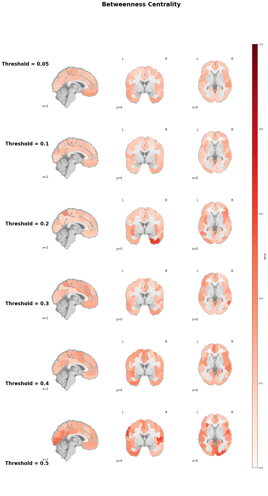
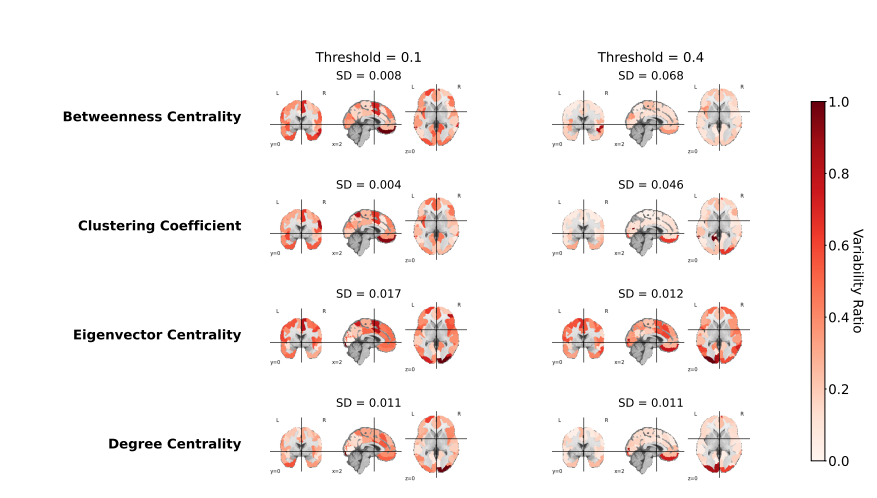
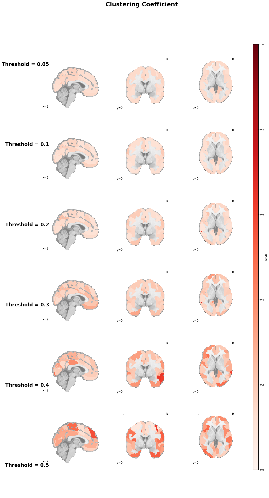
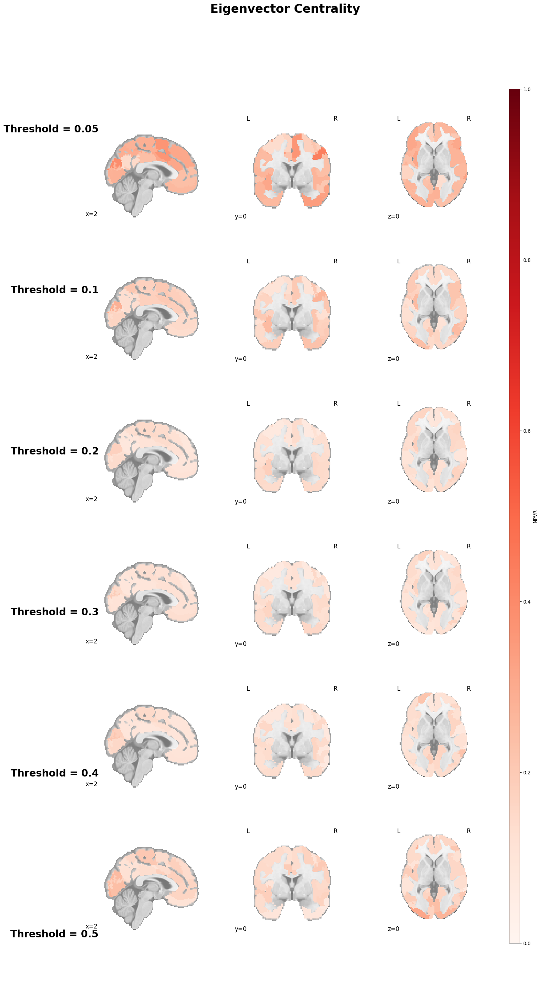

# What Is The Goal Of This Presentation?

- Explain what I have done so far
- Showcase my main results
- Explain what the next steps could be

# What Have I Done So Far?

 - Reproduced the @Alizadeh2025.12.22.695524 paper regarding  of  graph metrics
 - Perturbed fMRIPrep (@fMRIPrep) runs via Verificarlo (@denis2018verificarlocheckingfloatingpoint) and assessed the  matrices changes
 - Perturbed  matrices calculation and assessed the  features extraction changes

# @Alizadeh2025.12.22.695524 Paper Goals

The paper has 2 goals:

 - Demonstrate on simulated data that  increase uncertainty in Cohen's d estimates, with stronger effects at small n.
 - Assess how  perturbations via Verificarlo of fMRIPrep runs impact the  of various graph metrics.

Here is the formula for the :

$$NPVR = \frac{\sigma_{num}}{\sigma_{pop}}$$

Where $\sigma_{num}$ is the numerical variability and $\sigma_{pop}$ is the population variability.

# @Alizadeh2025.12.22.695524 Paper Reproduction Code

The code used for this section is available online: [https://olivier.amacker.dev/bachelor-thesis/site/notebooks/npvr-simulation/](https://olivier.amacker.dev/bachelor-thesis/site/notebooks/npvr-simulation/){target="_blank"}

{#fig-npvr-qr}

# @Alizadeh2025.12.22.695524 Paper NPVR Results Comparison

::: {layout="[ [1, 1, 1], [1, 1, 1] ]"}

{#fig-npvr-populations width="100%" height="150px"}

{#fig-npvr-sample-size width="100%" height="150px"}

{#fig-dnum-variation width="100%" height="150px"}

{#fig-original-population width="100%" height="150px"}

{#fig-original-cohens width="100%" height="150px"}

{#fig-original-npvr width="100%" height="150px"}

:::

# @Alizadeh2025.12.22.695524 Paper 

Regarding the Relation between the NPVR and the Cohen's $d$ differences, a  was open and merged into the paper's repository (see [here](https://github.com/mina94az/Numerical-Variability-of-functional-MRI-Graph-Measures/pull/3){target="_blank"})

{#fig-npvr-pr height="100px"}

# @Alizadeh2025.12.22.695524 Paper Graph Metrics

Here are the different graph metrics that were computed once with and once without confounds regression

4 local graph metrics were computed:

  - Degree centrality
  - Clustering coefficient
  - Betweenness centrality
  - Eigenvector centrality

2 global metrics:

  - Small-worldness
  - Average shortest path length

  
# @Alizadeh2025.12.22.695524 Paper Reproduction Code

The code used for this section is available online: [https://olivier.amacker.dev/bachelor-thesis/site/notebooks/fuzzy-fmriprep-graph-metrics-analysis.html](https://olivier.amacker.dev/bachelor-thesis/site/notebooks/fuzzy-fmriprep-graph-metrics-analysis.html){target="_blank"}

{#fig-graph-metrics-qr}

# @Alizadeh2025.12.22.695524 Paper Graph Metrics Results Comparison

::: {layout="[1, 1]"}

{#fig-graph-metrics-threshold width="100%" height="500px"}

{#fig-original-graph-metrics-threshold width="100%" height="500px"}

:::

# @Alizadeh2025.12.22.695524 Paper Graph Metrics Results Comparison

::: {layout="[1, 1]"}

{#fig-npvr-populations width="100%" height="500px"}

{#fig-npvr-sample-size width="100%" height="500"}
:::

# @Alizadeh2025.12.22.695524 Paper Graph Metrics Results Comparison

::: {layout="[1, 1]"}

{#fig-npvr-populations width="100%" height="500px"}

{#fig-npvr-sample-size width="100%" height="500"}
:::

# @Alizadeh2025.12.22.695524 Paper Graph Metrics Results Comparison

::: {layout="[1, 1]"}

{#fig-npvr-populations width="100%" height="500px"}

{#fig-npvr-sample-size width="100%" height="500"}
:::

# @Alizadeh2025.12.22.695524 Paper Graph Metrics Results Comparison

::: {layout="[1, 1]"}

{#fig-npvr-populations width="100%" height="500px"}

{#fig-npvr-sample-size width="100%" height="500"}
:::

# @Alizadeh2025.12.22.695524 Paper Graph Metrics Results Comparison

::: {layout="[1, 1]"}

{#fig-npvr-populations width="100%" height="500px"}

{#fig-npvr-sample-size width="100%" height="500"}
:::

# Perturbated FMRIPrep Runs  Matrices Analysis Goals

The goal of this section was to take the  perturbation via Verificarlo of fMRIPrep runs from the previous section, and examine the impact of the perturbations on the  matrices

# Perturbed FMRIPrep Runs  Matrices Analysis Code

The code used for this section is available online: [https://olivier.amacker.dev/bachelor-thesis/site/notebooks/fuzzy-fmriprep-fc-matrices-analysis.html](https://olivier.amacker.dev/bachelor-thesis/site/notebooks/fuzzy-fmriprep-fc-matrices-analysis.html){target="_blank"}

{#fig-npvr-qr}

# Perturbated FMRIPrep Runs  Matrices Analysis Results

::: {layout="[1, 1]"}

{#fig-npvr-populations width="100%" height="500px"}

{#fig-npvr-sample-size width="100%" height="500"}
:::

# References

::: {#refs}
:::

# Annex
Here is how the NPVR is calculated in details:

$$
  \sigma_{num}^2 = \frac{1}{m} \sum_{j=1}^m \left[ \frac{1}{n-1} \sum_{i=1}^n \left( x_{i,j} - \bar x_{.,j}\right)^2\right]
$$

$$
  \sigma_{pop}^2 = \frac{1}{n} \sum_{i=1}^n \left[ \frac{1}{m-1} \sum_{j=1}^m \left( x_{i,j} - \bar x_{i,.}\right)^2\right]
$$

$$
  NPVR = \frac{\sigma_{num}}{\sigma_{pop}}
$$
