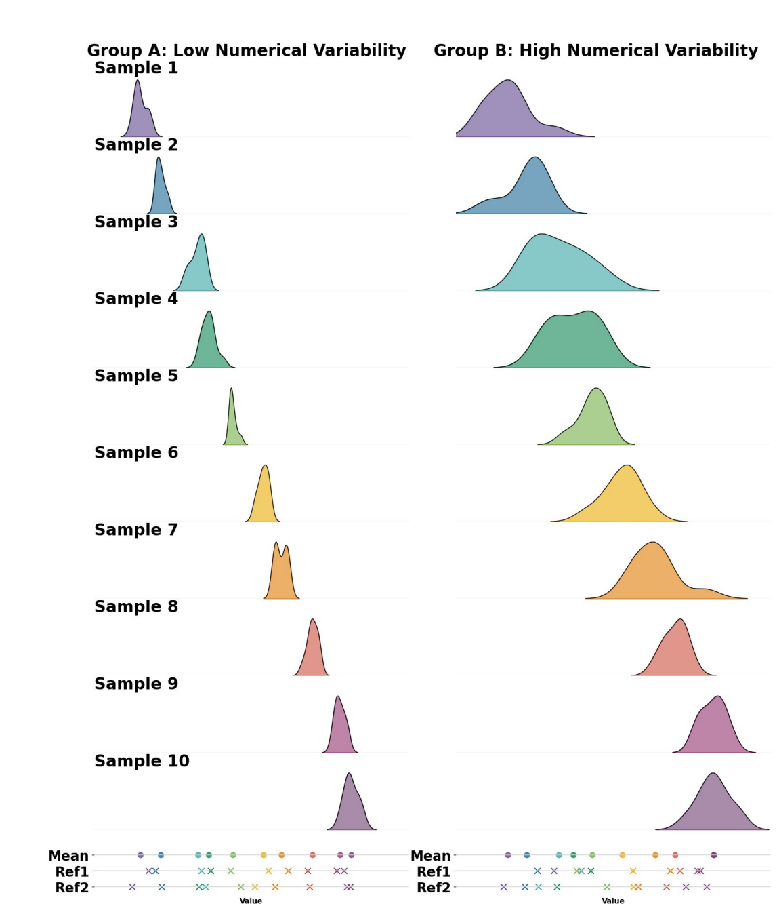
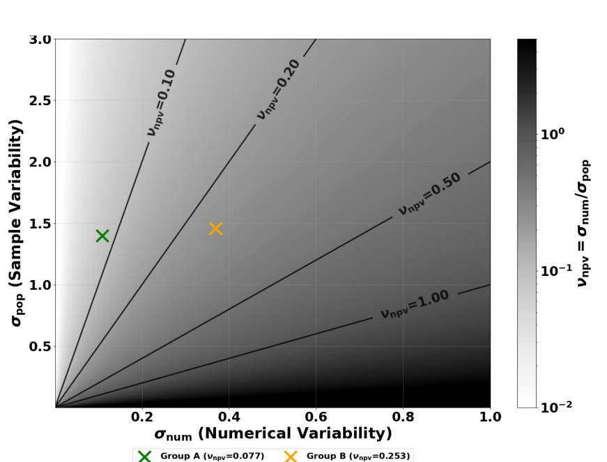
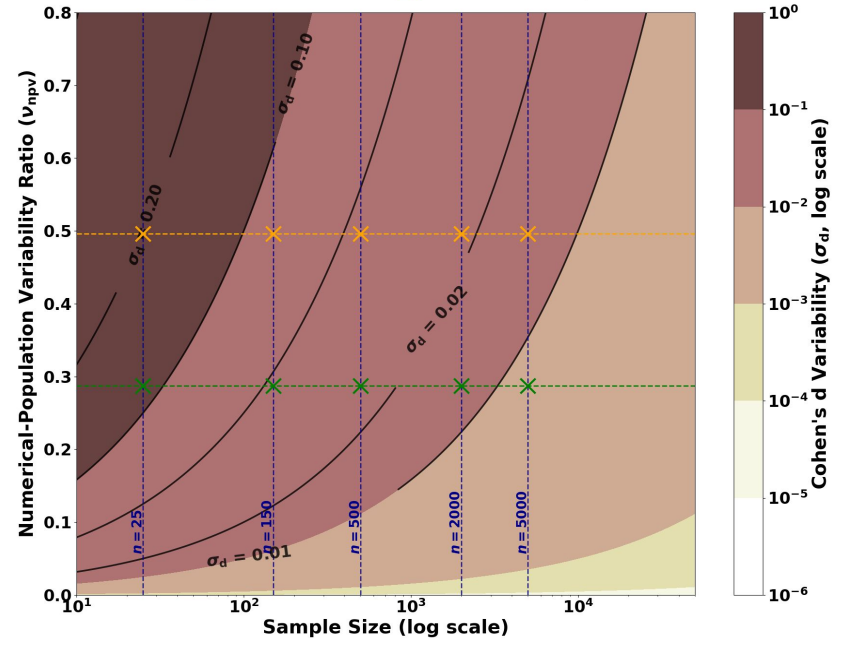
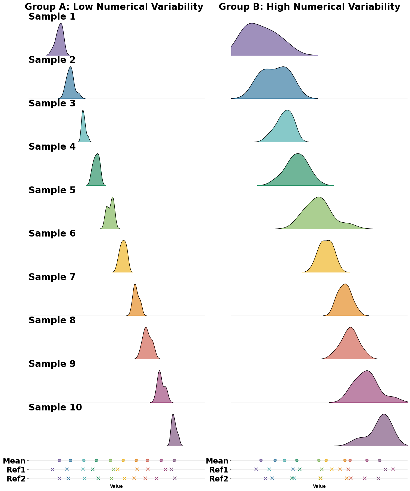
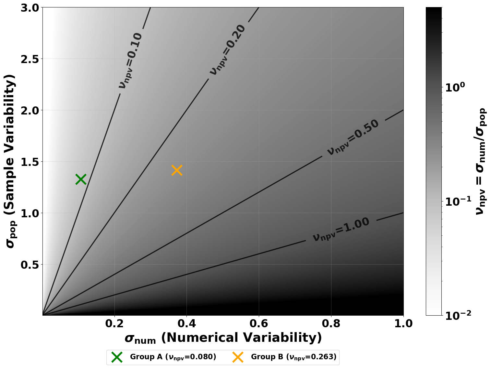
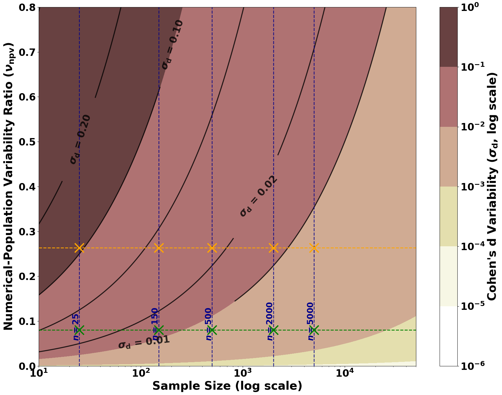
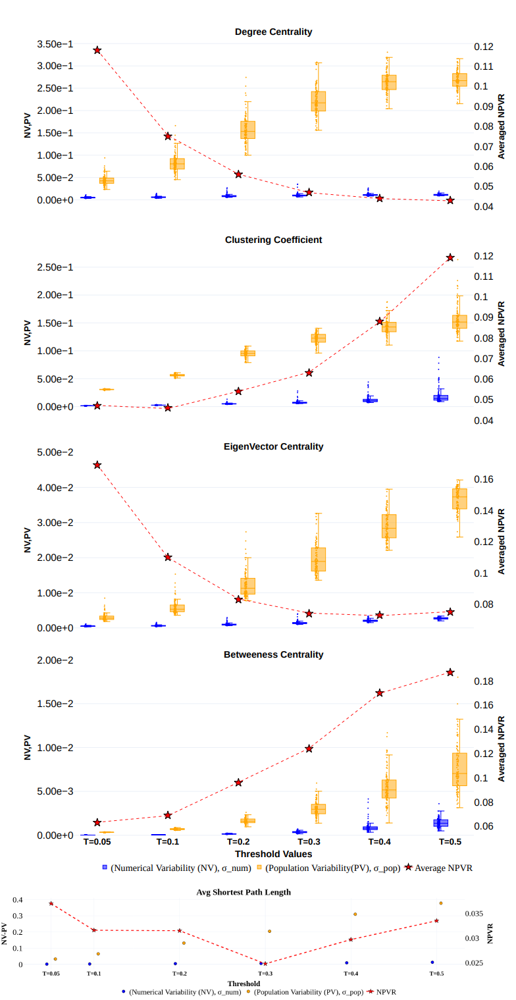
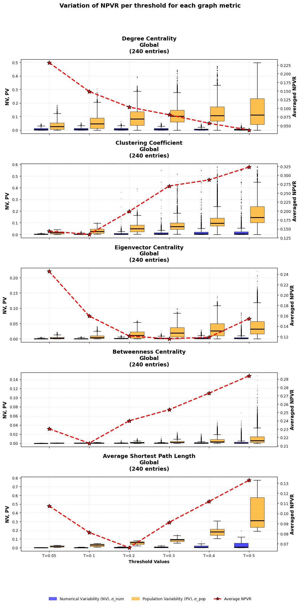
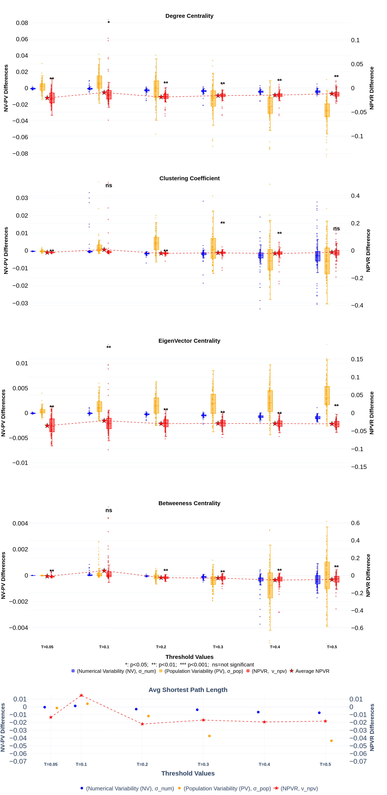
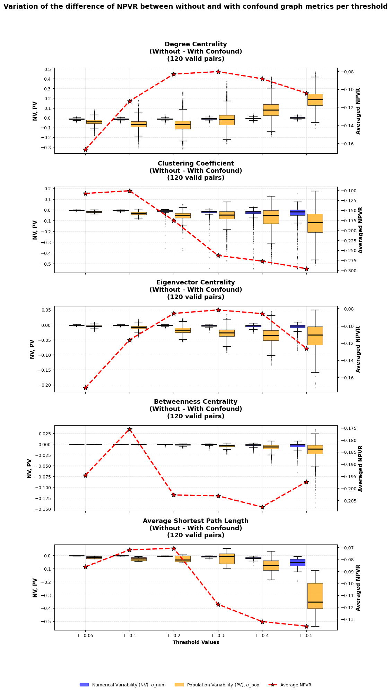

# Resources

This slide deck is available at this address:
<br>
[https://olivier.amacker.dev/bachelor-thesis/site/presentations/cbi_presentation.html](https://olivier.amacker.dev/bachelor-thesis/site/presentations/cbi_presentation.html)

{#fig-slide-qr height="100px"}

# The Problem With Current fMRI Pipelines

:::: {.columns}

::: {.column width="60%"}

fMRI pipelines are computationally heavy with high-dimensional calculations.

Sources of numerical instability:

- OS and version
- CPU architecture
- Parallelization strategies

:::

::: {.column width="40%"}

{#fig-os-results}

:::

::::

# Approach

Monte Carlo Arithmetic (MCA) (@Parker1997MonteCA): controlled random perturbations to floating-point operations.

Repeated runs quantify how numerical variability propagates.

Tools:

- [Verificarlo](https://github.com/verificarlo/verificarlo){target="_blank"}(@denis2018verificarlocheckingfloatingpoint): LLVM-level FP instrumentation
- [Fuzzy](https://github.com/verificarlo/fuzzy){target="_blank"}(@greg_kiar_2026_20906259): pre-instrumented Docker (NumPy, SciPy)


# Previous Studies Findings

Numerical instability confirmed across modalities:

- Functional imaging: NPVR of graph metrics derived from FC matrices across correlation thresholds, ranging from 0.1 to 0.2 (@Alizadeh2025.12.22.695524)
- Structural imaging: numerical variation in cortical thickness measures reaches 1/3 of population variability (@Chatelain2026.01.09.698203)
- Diffusion imaging: different computational environments produce different structural connectivity results (@kiar2021)

Heterogeneous methodologies prevent direct comparisons between studies.


# Contributions

Collaboration with ATR to investigate numerical stability of fMRI connectivity biomarkers.

Three complementary analyses:

1. Reproduce graph metrics stability assessment using NPVR (@Alizadeh2025.12.22.695524)
2. Assess edge-wise FC matrix stability and global signal regression effect
3. Evaluate PCA-based feature selection stability under perturbations (@10.1162/IMAG.a.1121)

# Code Availability

- Repository: [github.com/madeinshinea/bachelor-thesis](https://github.com/madeinshinea/bachelor-thesis)
- Website: [olivier.amacker.dev/bachelor-thesis](https://olivier.amacker.dev/bachelor-thesis)
- Docker: [hub.docker.com/r/madeinshinea/fuzzy-fmriprep](https://hub.docker.com/r/madeinshinea/fuzzy-fmriprep)

Environment: [Nix](https://nixos.org/) and [uv](https://docs.astral.sh/uv/)


:::: {.columns}
::: {.column width="25%"}
](../assets/presentations/final-presentation/npvr-simulation/qr-code.svg){#fig-npvr-qr height="100px"}
:::
::: {.column width="25%"}
](../assets/presentations/final-presentation/graph-metrics/qr_code.svg){#fig-graph-metrics-qr height="100px"}
:::
::: {.column width="25%"}
](../assets/presentations/final-presentation/fuzzy-fc-matrices/qr_code.svg){#fig-fuzzy-fc-matrices-qr height="100px"}
:::
::: {.column width="25%"}
](../assets/presentations/final-presentation/fuzzy-pca-analysis/fuzzy_pca_analysis_qr_code.svg){#fig-fuzzy-pca-qr height="100px"}
:::
::::

# @Alizadeh2025.12.22.695524 Paper Goals

Two goals:

1. Show on artificial data that NPVR increases uncertainty in Cohen $d$ estimates, especially at small sample sizes
2. Assess how Verificarlo perturbations of fMRIPrep runs impact graph metrics NPVR

$$NPVR = \frac{\sigma_{num}}{\sigma_{pop}}$$

$\sigma_{num}$ is numerical variability. $\sigma_{pop}$ is population variability.

# Paper Summary

Paper summary: [GitHub](https://github.com/MadeInShineA/bachelor-thesis-project/blob/7f64cf4d877eae5833f990eae917c7211c644841/resources/alizadeh-2025-paper-summary/Alizadeh2025_paper_summary.md){target="_blank"}

{#fig-paper-summary-qr height="100px"}

# Artificial NPVR Results Comparison

::: {layout="[ [1, 1, 1], [1, 1, 1] ]"}

{#fig-original-population height="200px"}


{#fig-original-npvr height="200px"}

{#fig-original-cohens height="200px"}


{#fig-npvr-populations height="200px"}

{#fig-dnum-variation height="200px"}

{#fig-npvr-sample-size height="200px"}

:::

# NPVR Simulation Bug Fix

The original Cohen $d$ plot used hardcoded NPVR values instead of computed ones. A fix was submitted and merged into the paper repository ([PR](https://github.com/mina94az/Numerical-Variability-of-functional-MRI-Graph-Measures/pull/3){target="_blank"}).

{#fig-npvr-pr height="100px"}

# @Alizadeh2025.12.22.695524 Graph Metrics

FC matrices: Schaefer 2018 parcellation (100 regions, 7 networks) with and without confound regression

Local metrics:

- Degree centrality
- Clustering coefficient
- Betweenness centrality
- Eigenvector centrality

Global metrics:

- Small-worldness
- Average shortest path length


# Differences from the Original Study

- Dataset: [BMB](https://mridata-brainminds-beyond.atr.jp/dataset/bmbpt/) (@KOIKE2021102600) vs original [PPMI](https://www.ppmi-info.org/access-data-specimens/download-data) (@marek2018)
- Confounds: 15 vs 6 (added global signal, cerebrospinal fluid, white matter, 6 anatomical component correlation)
- Container: custom fMRIPrep 25.2.5 vs Fuzzy's 23.2.1
- Small-worldness excluded (computational constraints)


# Graph Metrics NPVR per Threshold

::: {layout="[1, 1]"}

{#fig-original-graph-metrics-threshold height="550px"}

{#fig-graph-metrics-threshold height="550px"}

:::

# Graph Metrics Confound Regression Effect

::: {layout="[1, 1]"}

{#fig-npvr-variation-paper height="550px"}

{#fig-npvr-variation height="550px"}
:::


# Perturbed fMRIPrep Runs FC Matrices Analysis Goals

Assess NPVR across the 4950 edges of the 100 by 100 FC matrix upper triangle.

Analyzes FC matrices directly instead of derived graph metrics.

# Perturbed fMRIPrep Runs FC Matrices Analysis Results

::: {layout="[[1, 1], [1, 1]]"}

{#fig-fc-edge-npvr height="200px"}


{#fig-fc-edge-npvr-paper height="200px"}

{#fig-fc-edge-npvr height="200px"}

{#fig-fc-edge-npvr-paper height="200px"}
:::

# @10.1162/IMAG.a.1121 PCA Feature Selection Stability Analysis

PCA-based feature selection for robust FC biomarkers (MDD, SCZ, ASD) across datasets and sites.

# PCA Feature Selection Pipeline

1. PCA on all subjects' FC vectors to $n$ principal components
2. Test PCs against target variables:
   - Binary: t-test
   - Multi-level: ANOVA
   - Continuous: Pearson correlation
3. Select significant PCs (FDR-BH, $q < 0.05$)
4. Test FC weights (chi-squared, FDR-BH, $q < 0.05$)
5. Retain surviving FCs as biomarkers

# PCA Feature Selection Improvements

- Restructured into Python package ([PR #1](https://github.com/Ayumu722/pca-based-feature-extraction/pull/1){target="_blank"})
- Improved PC plots ([PR #3](https://github.com/Ayumu722/pca-based-feature-extraction/pull/3){target="_blank"})


# PCA Feature Selection Stability Analysis Procedure

- Reproduced on full [SRPB](https://bicr-resource.atr.jp/srpbsopen/) (@Tanaka2021) and [BMB](https://mridata-brainminds-beyond.atr.jp/dataset/bmbpt/) datasets
- Perturbation 1: MCA-instrumented `np.corrcoef` (100 runs SRPB, 15 BMB)
- Perturbation 2: PCA inputs 64-bit to 32-bit

PCA feature selection applied to each perturbed run.

# Effect of np.corrcoef Perturbation


# PCA Feature Selection Stability Results (SRPB)

:::: {.columns}
::: {.column width="50%"}
{#fig-srpb-original-fc-graph height="250px"}
:::
::: {.column width="50%"}
{#fig-srpb-fuzzy-consensus-fc-graph height="250px"}
:::
::::

:::: {.columns}
::: {.column width="25%"}
{#fig-srpb-original-edges height="200px"}
:::
::: {.column width="25%"}
{#fig-srpb-consensus-edges height="200px"}
:::
::: {.column width="25%"}
{#fig-srpb-original-inter height="200px"}
:::
::: {.column width="25%"}
{#fig-srpb-consensus-inter height="200px"}
:::
::::

# PCA Feature Selection Stability Results (BMB)

:::: {.columns}
::: {.column width="50%"}
{#fig-bmb-original-fc-graph height="250px"}
:::
::: {.column width="50%"}
{#fig-bmb-fuzzy-consensus-fc-graph height="250px"}
:::
::::

:::: {.columns}
::: {.column width="25%"}
{#fig-bmb-original-edges height="200px"}
:::
::: {.column width="25%"}
{#fig-bmb-consensus-edges height="200px"}
:::
::: {.column width="25%"}
{#fig-bmb-original-inter height="200px"}
:::
::: {.column width="25%"}
{#fig-bmb-consensus-inter height="200px"}
:::
::::

# Conclusion

1. Graph metrics NPVR: consistent trends with original study, but higher values using 15 confounds. Confound regression effect more variable across thresholds.

2. Edge-wise FC matrix NPVR: mean of 11 percent across 4950 edges. Doubles without global signal confound.

3. PCA feature extraction: fully robust under MCA perturbation and 32-bit precision.

# Future Directions

- Assess individual confound contributions to NPVR
- Perturb the cross-site harmonization step
- Perturb confound regression process itself

# Acknowledgement

- Prof. Dr Oscar Esteban for the opportunity to conduct this thesis abroad and for his supervision
- Dr Okito Yamashita and Dr Ayumu Yamashita for their dedication and continuous feedback
- Dr Yohan Chatelain for his help with Fuzzy perturbations
- ATR for providing the necessary resources and environment
- Family and friends for their emotional support

# References

::: {#refs}
:::

# Annex
Here is how the NPVR is calculated in details:

$$
  \sigma_{num}^2 = \frac{1}{m} \sum_{j=1}^m \left[ \frac{1}{n-1} \sum_{i=1}^n \left( x_{i,j} - \bar x_{.,j}\right)^2\right]
$$

$$
  \sigma_{pop}^2 = \frac{1}{n} \sum_{i=1}^n \left[ \frac{1}{m-1} \sum_{j=1}^m \left( x_{i,j} - \bar x_{i,.}\right)^2\right]
$$

$$
  NPVR = \frac{\sigma_{num}}{\sigma_{pop}}
$$


# Confounds Used For The Fuzzy FC Matrices Analysis

```Json
{
    "confound_columns": [
        "trans_x",
        "trans_y",
        "trans_z",
        "rot_x",
        "rot_y",
        "rot_z",
        "global_signal",
        "csf",
        "white_matter",
        "a_comp_cor_00",
        "a_comp_cor_01",
        "a_comp_cor_02",
        "a_comp_cor_03",
        "a_comp_cor_04",
        "a_comp_cor_05"
    ],
    "filtered_out_confound_columns": [
        "global_signal"
    ]
}
```
