# Resources

This slide deck is available at this address:
<br>
[https://olivier.amacker.dev/bachelor-thesis/site/presentations/cbi_presentation.html](https://olivier.amacker.dev/bachelor-thesis/site/presentations/cbi_presentation.html)

{#fig-slide-qr height="100px"}

#

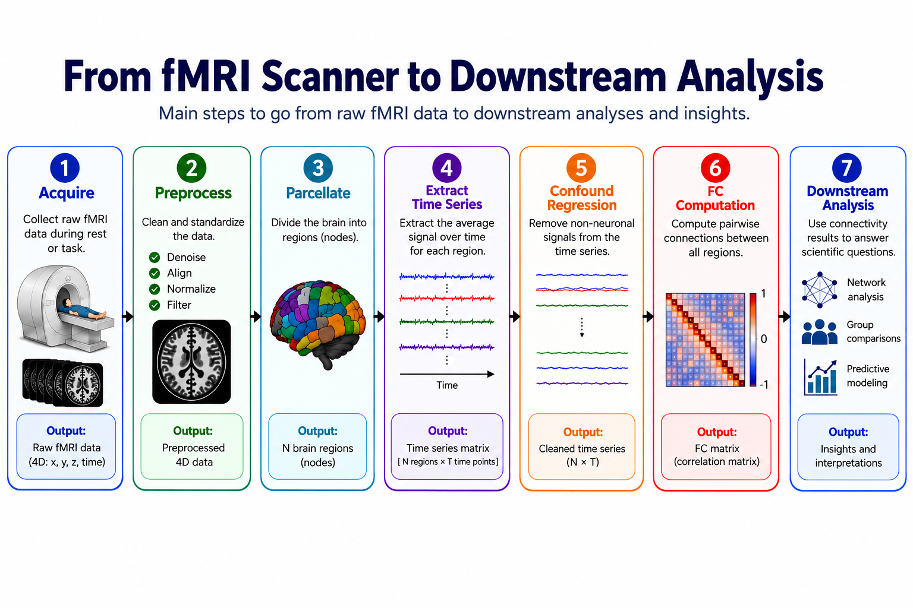{#fig-fmri}

# Numerical Variability and Reproducibility in fMRI pipelines

:::: {.columns}

::: {.column width="60%"}

fMRI pipelines are computationally heavy with high-dimensional calculations.

Sources of numerical instability:

- OS and version
- CPU architecture
- Parallelization strategies

:::

::: {.column width="40%"}

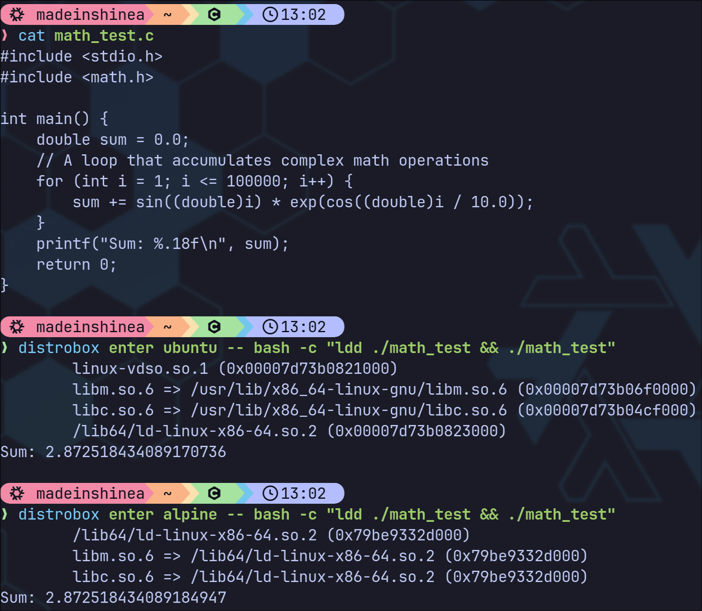{#fig-os-results}

:::

::::

# Numerical Perturbation Methods

A way to test numerical variability is actually introducing controlled numerical variability in pipelines of interest, at steps of interest, and see how that variability cascades downstream and in the final results.

One such approach is Monte Carlo Arithmetic (MCA) (@Parker1997MonteCA), which applies controlled random perturbations to floating-point operations.

Available libraries for pipeline instrumentation:

- [Verificarlo](https://github.com/verificarlo/verificarlo){target="_blank"}(@denis2018verificarlocheckingfloatingpoint): LLVM-level FP instrumentation
- [Fuzzy](https://github.com/verificarlo/fuzzy){target="_blank"}(@greg_kiar_2026_20906259): pre-instrumented Docker (NumPy, SciPy)


# Previous Findings

Numerical instability confirmed across modalities:

- Functional imaging: NPVR of graph metrics derived from FC matrices across correlation thresholds, ranging from 0.1 to 0.2 (@Alizadeh2025.12.22.695524)
- Structural imaging: numerical variation in cortical thickness measures reaches 1/3 of population variability (@Chatelain2026.01.09.698203)
- Diffusion imaging: different computational environments produce different structural connectivity results (@kiar2021)

Controlled numerical perturbations can also expand training datasets and improve deep learning generalization (@gonzalezpepe2026fuzzypytorchrapidnumerical)

Heterogeneous methodologies prevent direct comparisons between studies.


# Objectives

Collaboration with ATR to investigate numerical stability of fMRI connectivity biomarkers.

Three complementary analyses:

1. Reproduce graph metrics stability assessment using NPVR (@Alizadeh2025.12.22.695524)
2. Assess edge-wise FC matrix stability and global signal regression effect
3. Evaluate PCA-based feature selection stability under perturbations (@10.1162/IMAG.a.1121)

# Code Availability

- Repository: [github.com/madeinshinea/bachelor-thesis](https://github.com/madeinshinea/bachelor-thesis)
- Website: [olivier.amacker.dev/bachelor-thesis](https://olivier.amacker.dev/bachelor-thesis)
- Docker: [hub.docker.com/r/madeinshinea/fuzzy-fmriprep](https://hub.docker.com/r/madeinshinea/fuzzy-fmriprep)

Environment managed with [Nix](https://nixos.org/) and [uv](https://docs.astral.sh/uv/)

# Datasets

- [SRPB](https://bicr-resource.atr.jp/srpbsopen/) (@Tanaka2021): multi-site dataset (1,410 participants, 11 sites) for psychiatric biomarker research
- [BMB](https://mridata-brainminds-beyond.atr.jp/dataset/bmbpt/) (@KOIKE2021102600): Brain-MINDS Beyond dataset (~7,000 sessions, 23 sites) covering psychiatric and neurological disorders

# @Alizadeh2025.12.22.695524 Paper Goals

Two goals:

1. Show on artificial data that NPVR increases uncertainty in Cohen $d$ estimates, especially at small sample sizes
2. Assess how perturbations introduced by running fMRIPrep within a Fuzzy container impact graph metrics NPVR

$$NPVR = \frac{\sigma_{num}}{\sigma_{pop}}$$

$\sigma_{num}$ is numerical variability. $\sigma_{pop}$ is population variability.

# Replication of @Alizadeh2025.12.22.695524's Artificial NPVR

Broadly replicated the artificial NPVR simulation results.

Found an error in the original code: the Cohen $d$ plot used hardcoded NPVR values instead of computed ones. Hard to confirm as it was unclear whether the replication was wrong. Fix submitted and merged ([PR](https://github.com/mina94az/Numerical-Variability-of-functional-MRI-Graph-Measures/pull/3){target="_blank"}).

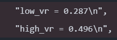{#fig-npvr-pr height="100px"}

# @Alizadeh2025.12.22.695524 Graph Metrics

FC matrices: Schaefer 2018 parcellation (100 regions, 7 networks) with and without confound regression

Local metrics:

- Degree centrality
- Clustering coefficient
- Betweenness centrality
- Eigenvector centrality

Global metrics:

- Small-worldness
- Average shortest path length


# Graph Metrics Results: NPVR per Threshold

::: {layout="[[1, 1]]"}

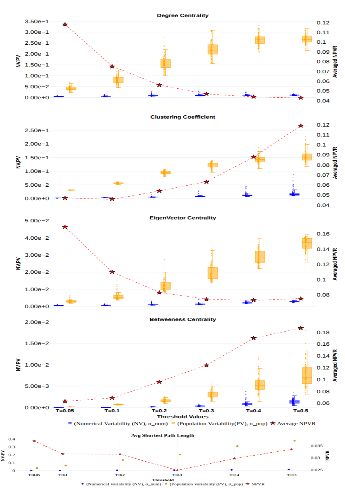{#fig-original-graph-metrics-threshold height="550px"}

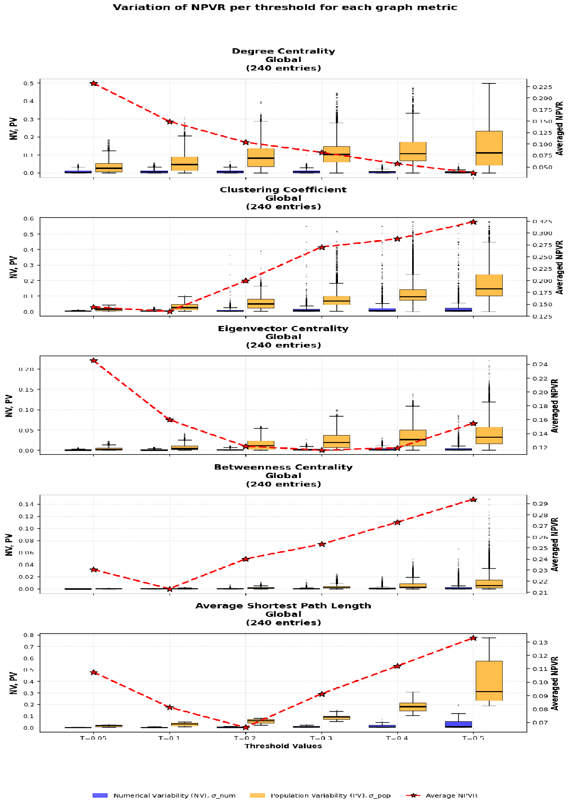{#fig-graph-metrics-threshold height="550px"}

:::

# Graph Metrics Results: Confound Regression Effect

::: {layout="[[1, 1]]"}

{#fig-npvr-variation-paper height="550px"}

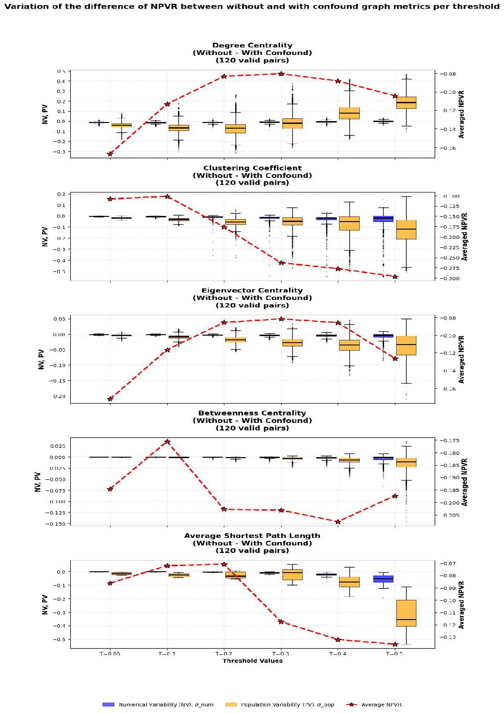{#fig-npvr-variation height="550px"}

:::

# Methodological Differences from the Original Study

- Dataset: [BMB](https://mridata-brainminds-beyond.atr.jp/dataset/bmbpt/) (@KOIKE2021102600) vs original [PPMI](https://www.ppmi-info.org/access-data-specimens/download-data) (@marek2018)
- Confounds: 15 vs 6 (added global signal, cerebrospinal fluid, white matter, 6 anatomical component correlation)
- Container: custom fMRIPrep 25.2.5 vs Fuzzy's 23.2.1


# FC Matrix Stability Analysis Goals

- Analyze FC matrices directly instead of derived graph metrics.
- Assess global signal regression's effect on edge-wise NPVR.

Global signal regression has been a contentious point in the field, with no settled agreement on whether it should or shouldn't be done.

# FC Matrix Stability Analysis Results

::: {layout="[[1, 1], [1, 1]]"}

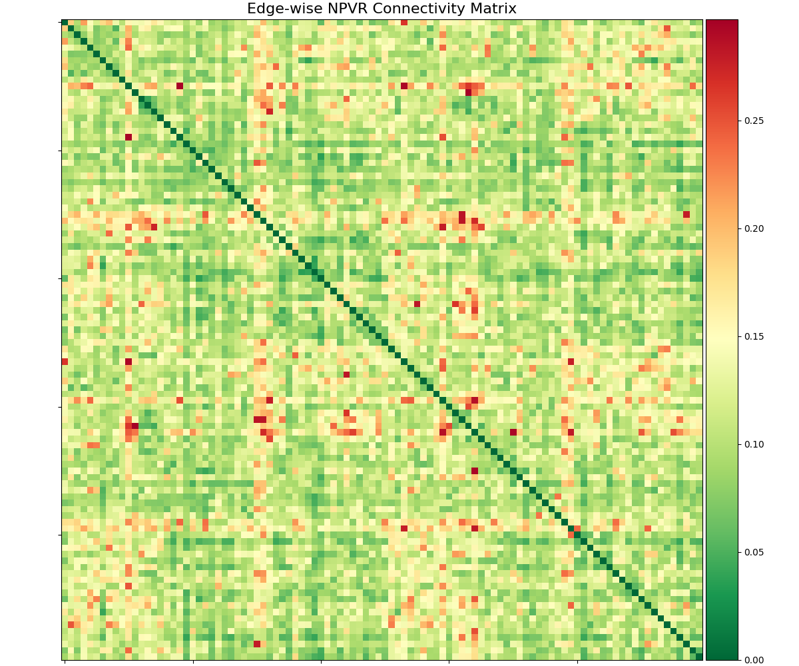{#fig-fc-edge-npvr height="200px"}


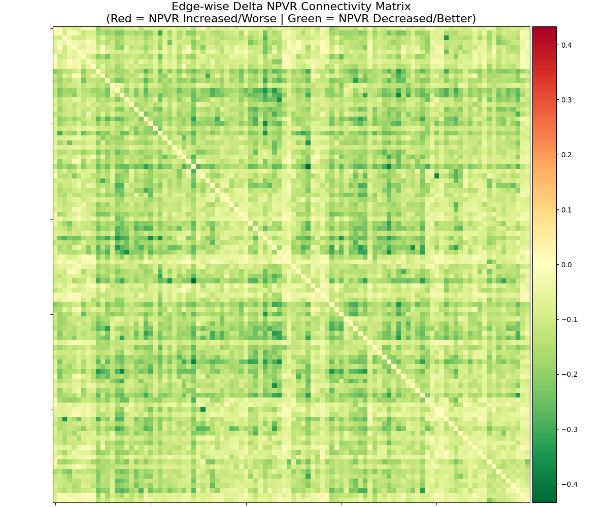{#fig-fc-edge-npvr-paper height="200px"}

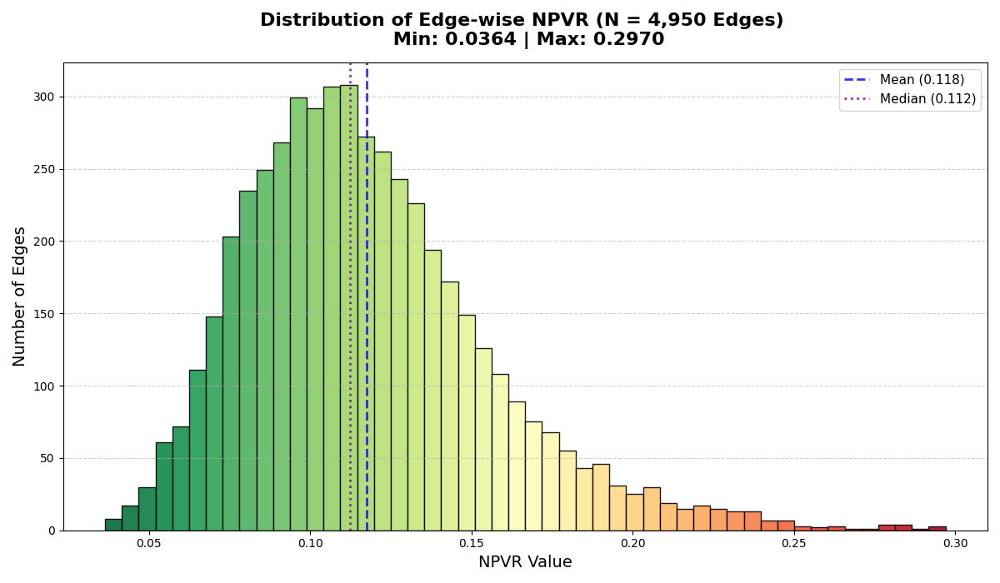{#fig-fc-edge-npvr height="200px"}

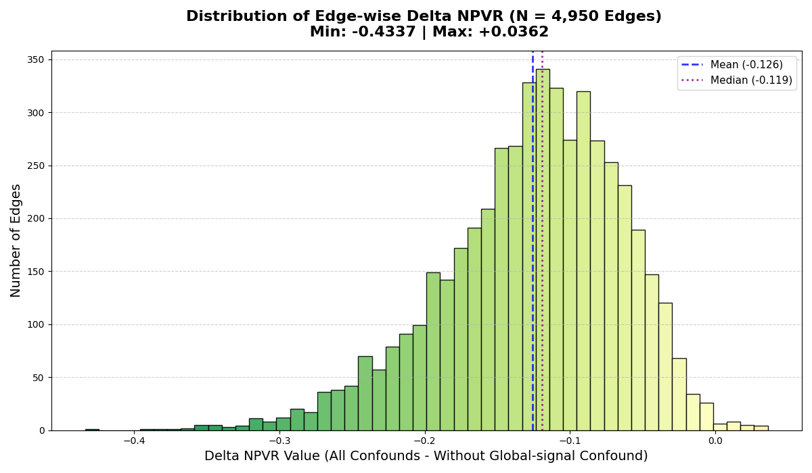{#fig-fc-edge-npvr-paper height="200px"}
:::

# @10.1162/IMAG.a.1121 PCA Feature Selection Stability Analysis

PCA-based feature selection for robust FC biomarkers (MDD, SCZ, ASD) across datasets and sites.

# PCA Feature Selection Pipeline

1. PCA on all subjects' FC vectors to $n$ principal components
2. Test PCs against target variables:
   - Binary: t-test
   - Multi-level: ANOVA
   - Continuous: Pearson correlation
3. Select significant PCs (FDR-BH, $q < 0.05$)
4. Test FC weights (chi-squared, FDR-BH, $q < 0.05$)
5. Retain surviving FCs as biomarkers

# PCA Feature Selection Improvements

- Restructured into Python package ([PR #1](https://github.com/Ayumu722/pca-based-feature-extraction/pull/1){target="_blank"})
- Improved PC plots ([PR #3](https://github.com/Ayumu722/pca-based-feature-extraction/pull/3){target="_blank"})


# PCA Feature Selection Stability Analysis Procedure

- Reproduced on full [SRPB](https://bicr-resource.atr.jp/srpbsopen/) (@Tanaka2021) and [BMB](https://mridata-brainminds-beyond.atr.jp/dataset/bmbpt/) datasets
- Perturbation 1: MCA-instrumented `np.corrcoef` (100 runs SRPB, 15 BMB)
- Perturbation 2: PCA inputs 64-bit to 32-bit

# PCA Feature Selection Stability Results (SRPB)

:::: {.columns}
::: {.column width="50%"}
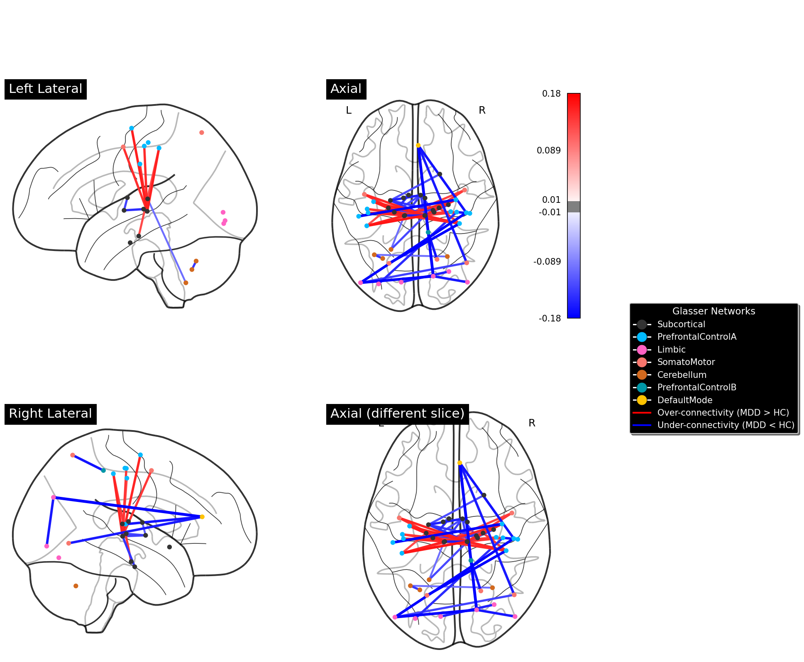{#fig-srpb-original-fc-graph height="250px"}
:::
::: {.column width="50%"}
{#fig-srpb-fuzzy-consensus-fc-graph height="250px"}
:::
::::

:::: {.columns}
::: {.column width="25%"}
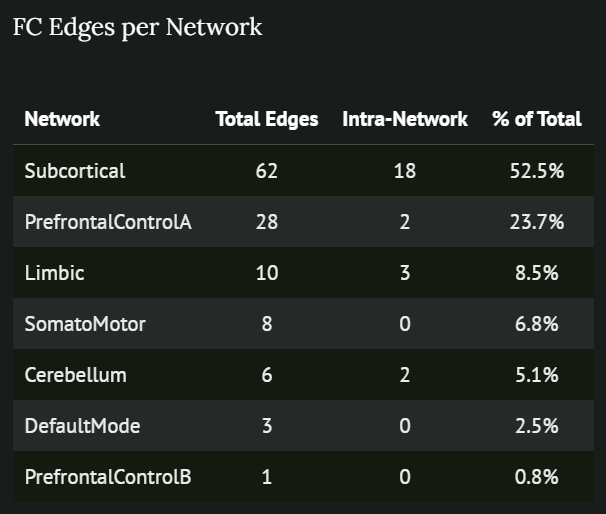{#fig-srpb-original-edges height="200px"}
:::
::: {.column width="25%"}
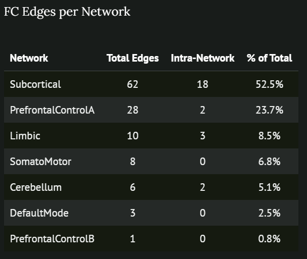{#fig-srpb-consensus-edges height="200px"}
:::
::: {.column width="25%"}
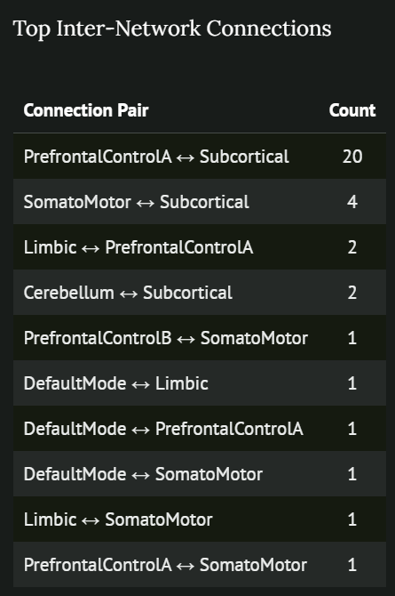{#fig-srpb-original-inter height="200px"}
:::
::: {.column width="25%"}
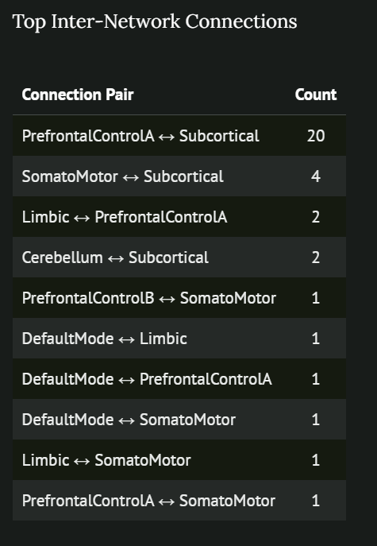{#fig-srpb-consensus-inter height="200px"}
:::
::::

# PCA Feature Selection Stability Results (BMB)

:::: {.columns}
::: {.column width="50%"}
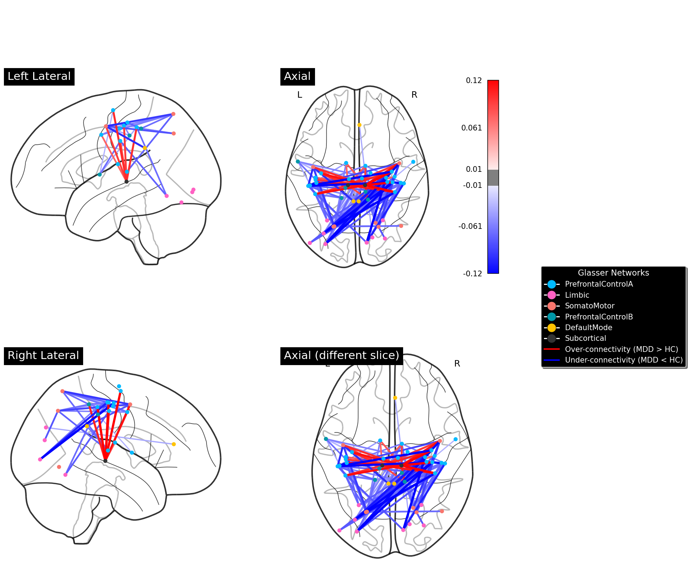{#fig-bmb-original-fc-graph height="250px"}
:::
::: {.column width="50%"}
{#fig-bmb-fuzzy-consensus-fc-graph height="250px"}
:::
::::

:::: {.columns}
::: {.column width="25%"}
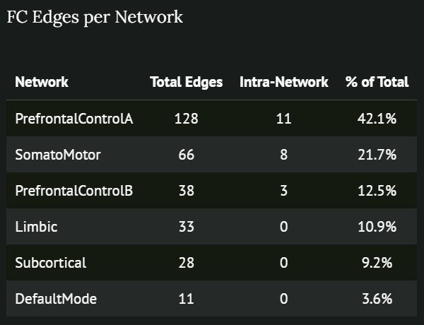{#fig-bmb-original-edges height="200px"}
:::
::: {.column width="25%"}
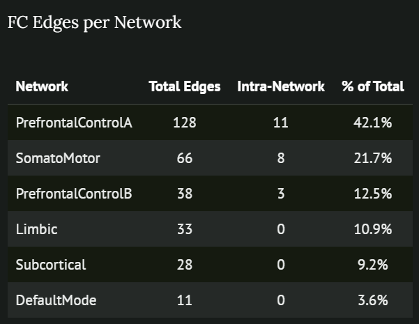{#fig-bmb-consensus-edges height="200px"}
:::
::: {.column width="25%"}
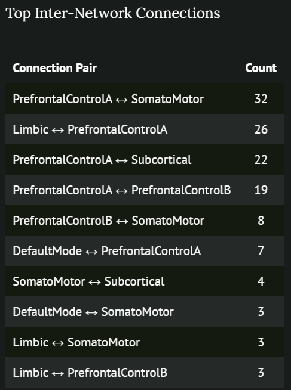{#fig-bmb-original-inter height="200px"}
:::
::: {.column width="25%"}
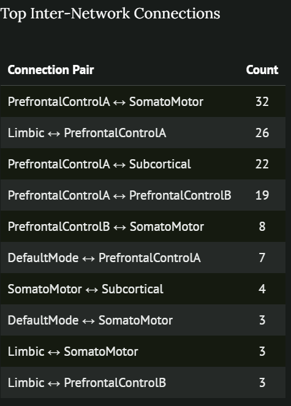{#fig-bmb-consensus-inter height="200px"}
:::
::::

# Conclusion

1. Graph metrics NPVR: consistent trends with original study, but higher values using 15 confounds. Confound regression effect more variable across thresholds.

2. Edge-wise FC matrix NPVR: mean of 11 percent across 4950 edges. Doubles without global signal confound.

3. PCA feature extraction: fully robust under MCA perturbation and 32-bit precision.

Future work:

- Assess individual confound contributions to NPVR
- Perturb the cross-site harmonization step
- Perturb confound regression process itself

# References

::: {#refs}
:::

# Acronyms

<table>
<tr><th>Acronym</th><th>Definition</th></tr>
<tr><td>fMRI</td><td>functional Magnetic Resonance Imaging</td></tr>
<tr><td>OS</td><td>Operating System</td></tr>
<tr><td>MCA</td><td>Monte Carlo Arithmetic</td></tr>
<tr><td>LLVM</td><td>Low Level Virtual Machine</td></tr>
<tr><td>NPVR</td><td>Numerical to Population Variability Ratio</td></tr>
<tr><td>FC</td><td>Functional Connectivity</td></tr>
<tr><td>ATR</td><td>Advanced Telecommunications Research Institute International</td></tr>
<tr><td>PCA</td><td>Principal Component Analysis</td></tr>
<tr><td>PR</td><td>Pull Request</td></tr>
<tr><td>BMB</td><td>Brain Minds Beyond Dataset</td></tr>
</table>

# Acronyms

<table>
<tr><th>Acronym</th><th>Definition</th></tr>
<tr><td>CSF</td><td>Cerebrospinal Fluid</td></tr>
<tr><td>MDD</td><td>Major Depressive Disorder</td></tr>
<tr><td>SCZ</td><td>Schizophrenia</td></tr>
<tr><td>ASD</td><td>Autism Spectrum Disorder</td></tr>
<tr><td>ANOVA</td><td>Analysis of Variance</td></tr>
<tr><td>FDR-BH</td><td>False Discovery Rate - Benjamini-Hochberg</td></tr>
<tr><td>SRPB</td><td>SRPB Dataset</td></tr>
</table>

# Annex
Here is how the NPVR is calculated in details:

$$
  \sigma_{num}^2 = \frac{1}{m} \sum_{j=1}^m \left[ \frac{1}{n-1} \sum_{i=1}^n \left( x_{i,j} - \bar x_{.,j}\right)^2\right]
$$

$$
  \sigma_{pop}^2 = \frac{1}{n} \sum_{i=1}^n \left[ \frac{1}{m-1} \sum_{j=1}^m \left( x_{i,j} - \bar x_{i,.}\right)^2\right]
$$

$$
  NPVR = \frac{\sigma_{num}}{\sigma_{pop}}
$$


# Confounds Used for the Fuzzy FC Matrices Analysis

```Json
{
    "confound_columns": [
        "trans_x",
        "trans_y",
        "trans_z",
        "rot_x",
        "rot_y",
        "rot_z",
        "global_signal",
        "csf",
        "white_matter",
        "a_comp_cor_00",
        "a_comp_cor_01",
        "a_comp_cor_02",
        "a_comp_cor_03",
        "a_comp_cor_04",
        "a_comp_cor_05"
    ],
    "filtered_out_confound_columns": [
        "global_signal"
    ]
}
```
